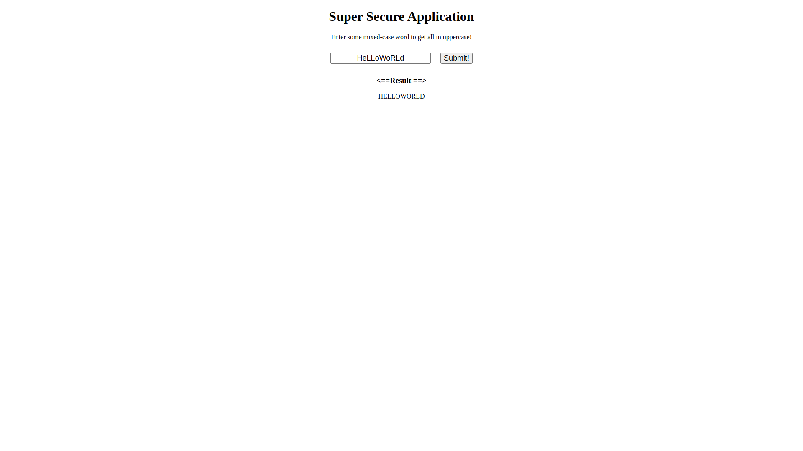
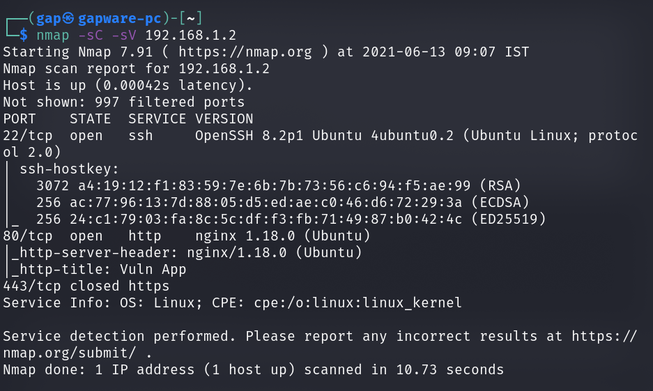
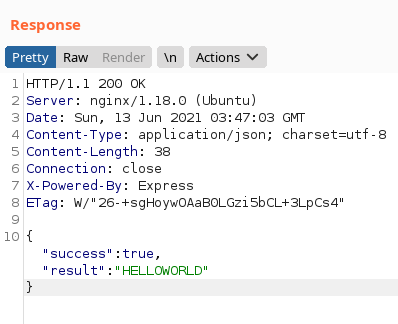
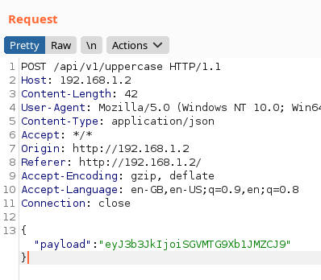
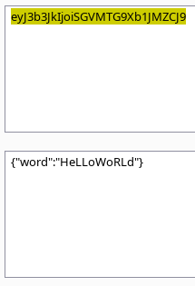
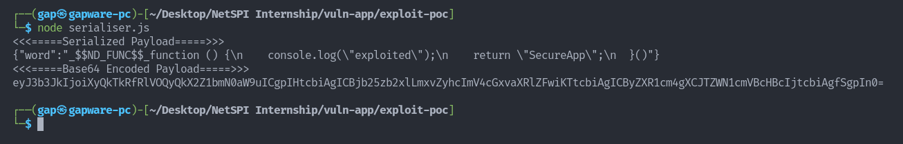
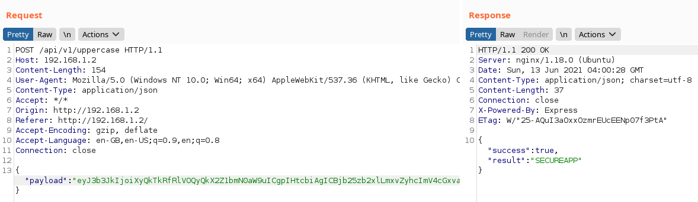
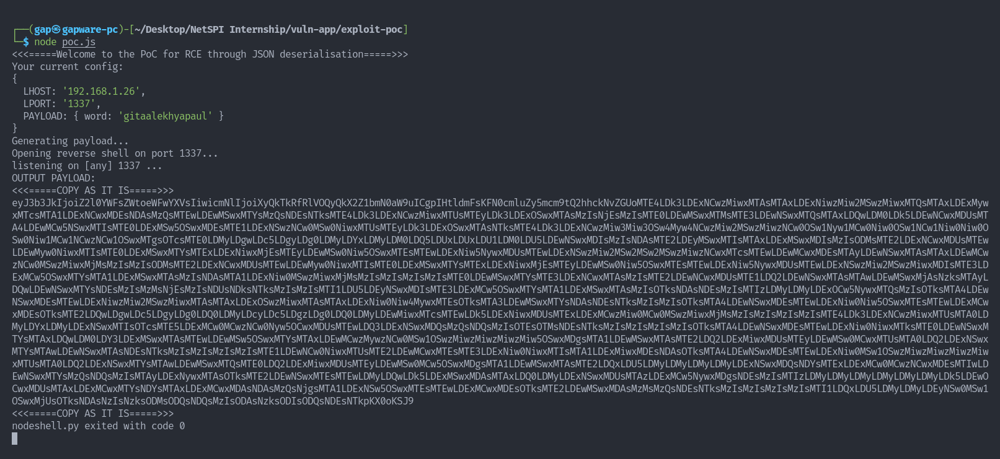
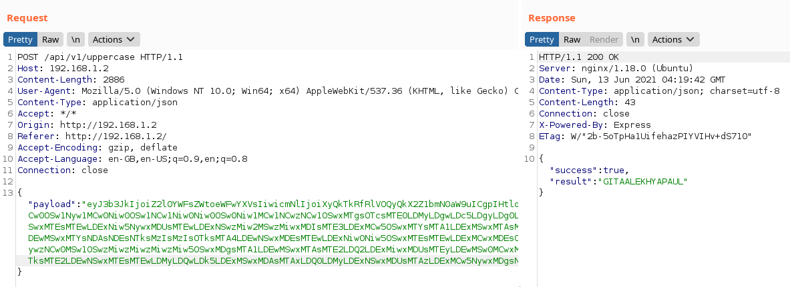
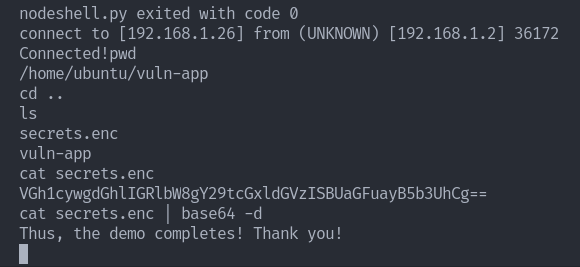

# vuln-app

An app vulnerable to JSON deserialisation attack (CVE-2017-5941). This application serves as a PoC for the exploit and aims at teaching how deserialisation vulnerabilities work.

---

> **Presentation:**
>
> - **Date:** 14th June, 2021
> - **Location:** NetSPI
> - **Slideshow:** The slideshow can be found [**here**](./assets/PPT.pdf).

---

# Setting up the virtual lab:

## Pre-requisite:

- Node.js installed
- Python installed
- A vulnerable server, preferably a Raspberry Pi or VM instance

## Setup Scripts

- Installing dependencies:
  - ```bash
    yarn
    ```
- Building the application
  - ```bash
    yarn build
    ```
- Copy the `.env.sample` to a file called `.env` and edit the port and set mode to **production**
- Start the application
  - ```bash
    yarn start
    ```

# Exploiting the application:

## Preview:

A preview of the website shows, that it converts a mixed-case string to uppercase string.



## Scanning:

Scanning, the services using `nmap`, we discover it is serving a website through NGINX on Port 80.



Opening the website, and sending a sample request, the response headers reveal that the web server is running Node.js and Express.js

### Response Sample



### Request Sample



The **`payload`** property looks like a Base64-encoded string, decoding it we see that it is a JSON encoded which contains our form input.



## Testing for Vulnerability

Now that we have a rough idea of the stack and the request payload format, let us write a code to check if RCE using JSON deserialisation exists in the application.

### Explaining [**`serialiser.js`**](exploit-poc/serialiser.js) code:

The file aims to test the vulnerability by writing an IIFE(Immediately Invoked Function Expression) which will return a normal string but will execute a `console.log` while the JSON is being deserialized.

### Creating the test malicious payload and testing it:

Create the malicious payload and use BurpSuite to modify an intercepted request and paste the mailicous payload.



The server returns an absolutely normal response, confirming that the server is vulnerable to JSON deserialisation.



## Creating Exploit:

Now that we know the server is vulnerable, let us try to create a malicious payload which can open up a reverse shell on the victim server.

### Explaining the [**`poc.js`**](exploit-poc/poc.js) code:

The exploit PoC does the following tasks:

- Using [`socket.js`](exploit-poc/socket.js) file, it aims to open a reverse shell on the victim system by calling a child process of `/bin/sh` and pipe it through WebSockets, thus giving the attacker access to the shell.
- In order to easily deserialize the function, [`nodeshell.py`](exploit-poc/nodeshell.py) converts the above program into charCode and appends an `eval()` so that JS will directly evaluate its contents.
- Then, the [`poc.js`](exploit-poc/poc.js) file creates an object with an extra property **`rce`** which contains an IIFE containing the malicious payload.
- **In order to use the exploit:**
  - Change the `LHOST` to your IP on your local network (considering your victim machine is on local network), or your Public IP (considering your victim machine is on public network).
  - Change the `LPORT` to the port on which you want to open up the reverse shell.
  - The file on execution, will generate the payload, and open up the reverse shell

### Generating the payload, and opening up the reverse shell

Generating the reverse shell payload through [`poc.js`](exploit-poc/poc.js) and listening on `LPORT` for incoming connections.



The server executes the request normally, but the reverse shell has already opened!



### Server exploited successfully!



# Credits and References:

- https://github.com/ajinabraham/Node.Js-Security-Course
- https://0xdf.gitlab.io/2018/08/25/htb-celestial.html
- https://opsecx.com/index.php/2017/02/08/exploiting-node-js-deserialization-bug-for-remote-code-execution/
- https://portswigger.net/web-security/deserialization
